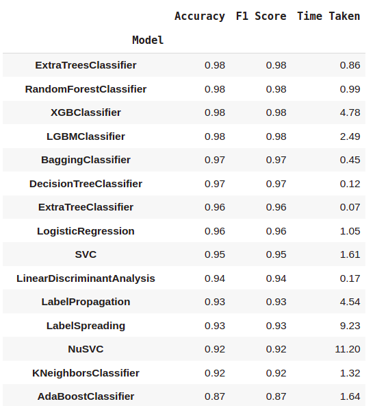
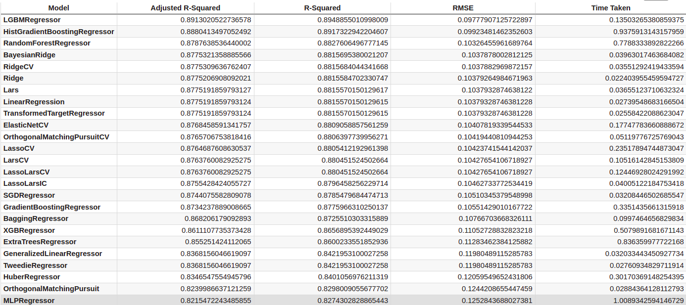

# Challenge-2-LA-Team-A (Demonic Flanders)

Anandita Nadkarni, Yash Mate, Ming Wang, Saurabh Koshatwar, Kanish Nimesh Shah, Jonah Fisher

## 1.Introduction
The goal of our project is to analysis the LASI-DAD data and learn the patterns to predict the whether a person has dementia.

## 2.Dataset
- LASI-DAD is the first and only nationally representative study on late-life cognition and
dementia in India. 
- It is drawn from what is currently a cross-sectional sample of 4,096 community-residing older adults 60+ years of age from the larger LASI study (N ~ 70,000), which is a prospective, multi-purpose population survey, representative of both the entire country and of each state within India.

## 3.Methods
### Data Cleaning and Augmentation
- Handled Data Imbalance using SMOTE
- Data Imputation with K Nearest Neighbors
- Correlation analysis using Pearson
- Dimensionality reduction with:
  - *Removing the columns which have more than 50% missing values
  - *Removing the variables which have less than 5% correlation with the target
  - *Removing the variables which have more than 90% correlation with each other
  - *Using SHAP and Random Forest to select 27 most important features

### Machine Learning
- Applied both classification and regression.
  - Highlight methods: Random Forest
    - NaN / missing values
    - Imbalanced Data
    - Robust to outliers
    - Reduces bias and variance
    - Avoids over fitting

## 4.Results
- Classification

- Regression

